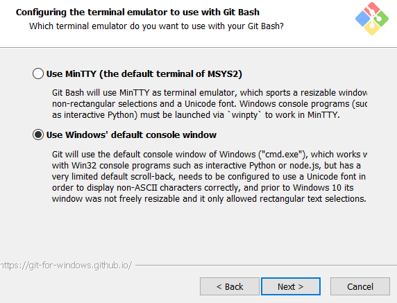

# Daijirin Scraper | 大辞林 スクレーパー
## Purpose of this script
To scrape dictionary definition data from [weblio.jp](http://www.weblio.jp/) for definitions from the all-wonderful 三省堂 大辞林 (Daijirin), a monolingual Japanese dictionary. It then parses the proper HTML to it for use with my proprietary Anki definition template (CSS stylesheet for this template will be available when I get closer to finishing the add-on).

## Goals for this project
This is my first script written in Python. I would like to eventually create a GUI in PyQt so that it can be bundled and shipped directly into Anki as a shared add-on.

## Now
Right now it can be ran through the Python 3 interpreter and scrape for a word passed in as an argument immediately following the script. Tested with Python 3.6.1

## Instructions
To run the script and add a definition to the **definitions.txt** file, go to the directory where the script is downloaded to and run the following command.

**Git bash on Windows / Linux / Mac**

**NOTE:** _the Windows git bash terminal must be installed with the option to emulate inside of **cmd.exe**. The reason is the default git bash terminal that git will install gives you unicode charmap encoding errors when trying to execute the python script. I have included a screenshot below<sup>**1**</sup> to show the needed installation option._

```
python.exe daijirin-scraper.py 言葉
```
(言葉 can obviously be replaced with any term you would like to try)

You can alternatively make a shell script (e.g. - daijirin-scraper.sh), add it to a directory in your path, and run it like this:
```
daijirin-scraper.sh 言葉
```

Then with your favirite text editor, open the **definitions.txt** file located in the same directory as the script. If your term's definition was able to be located by the scraper, it should have added it to the file with the brackets and proper HTML tags. If not, there could possibly be no entries for the search you tried or the word may have too many nest levels (see warning below). In that case I would go to the [weblio.jp](http://www.weblio.jp/) site and see for yourself what happened.

Once you have the desired defnitions in **definitions.txt**, you can run:
```
python(.exe) daijirin-scraper.py cut
```

This will cut the definitions from the text file into your clipboard so you can paste into your Anki card fields. After running this command, **definitions.txt** will be empty so that it is ready when you want to use it next.

If you only want to empty the **definitions.txt** file without copying them to your clipboard, you can run:
```
python(.exe) daijirin-scraper.py clear
```
to clear the file.


## Dependencies, required modules, etc.
* Obviously, you will need Python installed (v3.6)
* BeautfulSoup4
* urllib.request
* urllib.parse
* sys
* os
* pyperclip

### Warning: this add-on will only support single-level nested definitions.
It will not support multi-level nested definitions. At that point, I think you would be doing yourself a disservice listing out an entire definition on a flash card. Also, with Weblio's terrible web architecture, the means by which creating something that could extract multi-level nests would not be an efficient effort, and I need to focus my time and energy on other things (like studying Japanese and building more tools to help people learn languages).

If you need to reference a word with a lengthy multi-nested list of definitions, I would suggest finding the one or two specific definitions that describe the word's usage in the flash card's context, and copy-pasting those manually into your cards.

### Currrent TODOs:
1. Add aqt GUI for Anki and add command that automatically fills the user's specified definition field.
2. GUI should contain a dropdown menu to select the Anki note field where definitions will be injected.
3. Create multiple-entry functionality for words with more than one pronunciation/entry using _find_all_. Allow user to select the desired entry from a generated list from the _find_all_ implementation.

## Footnotes:

### <sup>1</sup> Windows git bash required installation option:



This screen with shows the correctly selected bullet option for using the cmd emulator to run git bash. Git bash must be installed with the following option below in order to avoid charmap encoding errors with this web scraper.
